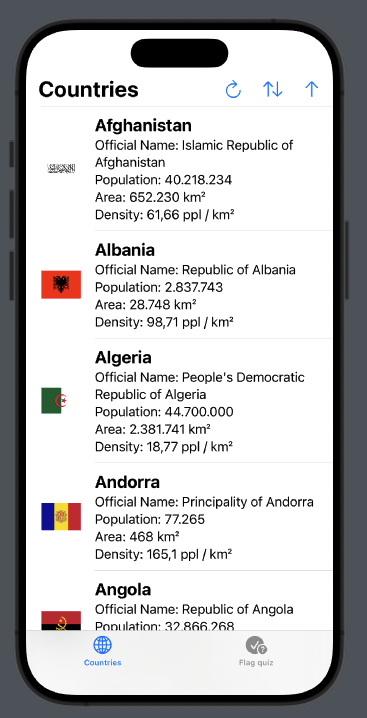
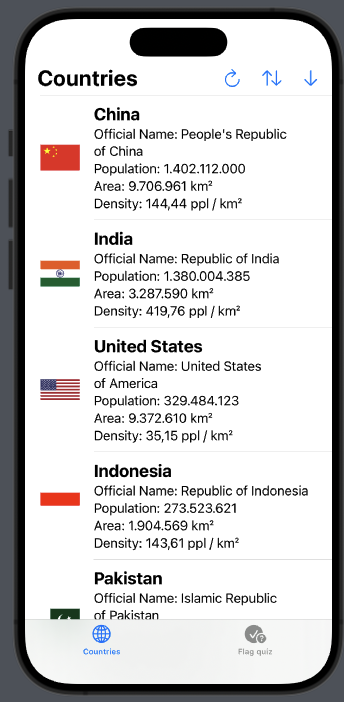
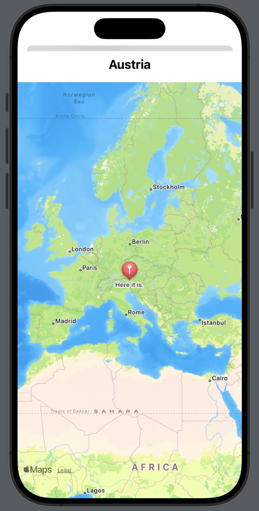
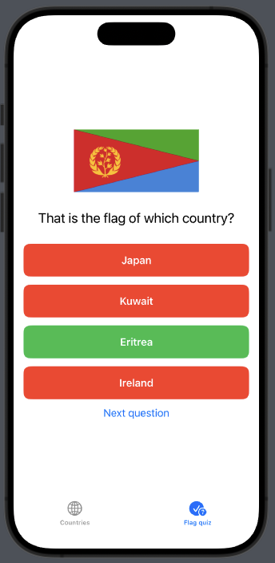
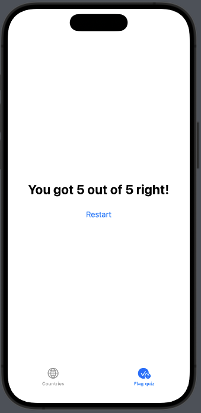

# What is this?

Just a litte SwiftUI for testing out some features like REST API requests, navigation views and tab views. To be specific, the app

* fetches all countries from [REST countires](https://restcountries.com/)
* shows them in a list (this list can be sorted by various properties)
* shows the country on a map if you tap on it
* and has a little guess-the-flag-quiz included

What's currently missing:

* a bit of recactoring
* error handling

## Screenshots

